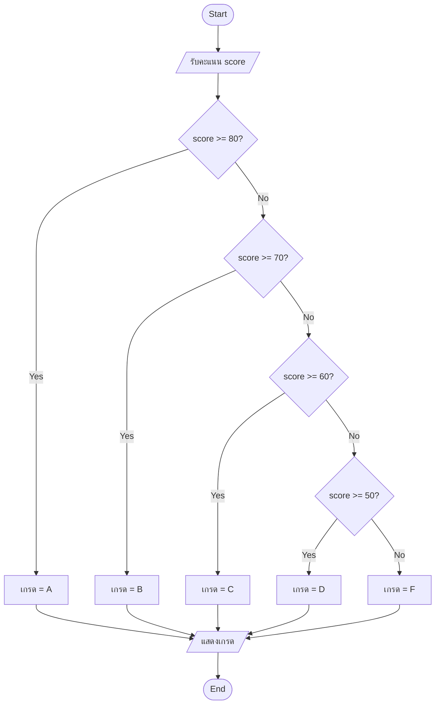
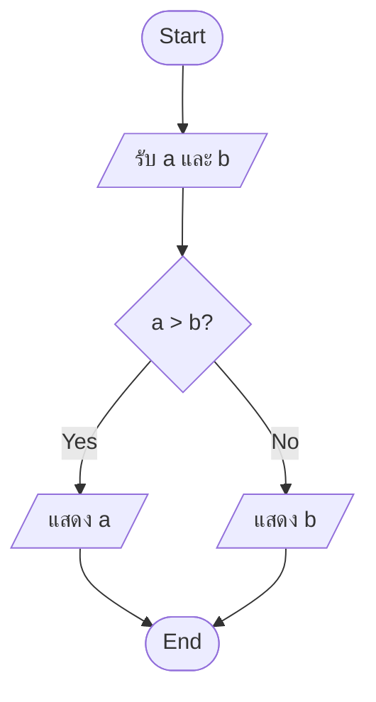

```mermaid
flowchart TD
Start([Start]) --> Input[/รับคะแนน score/]
Input --> D1{score >= 80?}
D1 -->|Yes| A[เกรด = A]
D1 -->|No| D2{score >= 70?}
D2 -->|Yes| B[เกรด = B]
D2 -->|No| D3{score >= 60?}
D3 -->|Yes| C[เกรด = C]
D3 -->|No| D4{score >= 50?}
D4 -->|Yes| D[เกรด = D]
D4 -->|No| F[เกรด = F]
A & B & C & D & F --> Output[/แสดงเกรด/]
Output --> End([End])
```


```mermaid
flowchart TD
Start([Start]) --> Input[/รับ a และ b /]
Input --> D1{a > b?}
D1 -->|Yes| a[/แสดง a/]
D1 -->|No| b[/แสดง b/]
a & b --> OutputEnd([End])

```

```mermaid
flowchart TD
Start([Start]) --> Input[/รับ N /]
Input --> D1[ i = 1]
D1 --> D2{i <= N?}
D2 -->|Yes| D3[/พิมพ์ i/]
D2 -->|No| B((end))
D3 --> D4[ i = i + 1 ]
D4 --> D2