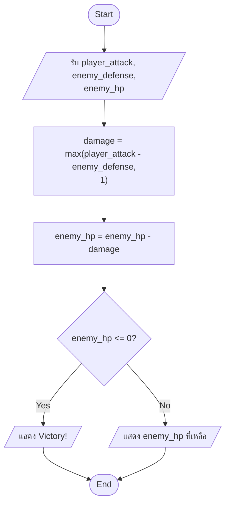
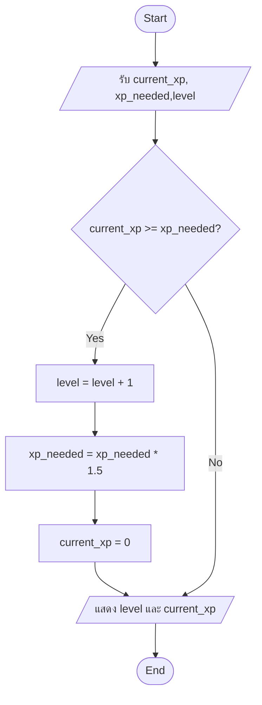

```mermaid
flowchart TD
Start([Start]) --> Input[/รับ pos = A, dir = forward/]
Input --> D1{ระยะถึง player < 100?}
D1 -->|Yes| D2[/chase player/]
D2 --> End([End])

D1 -->|No| D3[เลื่อน enemy ตาม dir ]
D3 --> D4{ถึงจุด B?}
D4 -->|Yes| D5[dir = กลับไป A]
D5 --> D1
D4 -->|No| D6{ถึงจุด A?}
D6 -->|Yes| D7[dir = ไปหน้า B]
D7 --> D1
D6 -->|No| D1